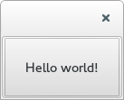

:title: Python <3 Qt
:author: Amy Boyle
:description: Intro to Desktop Applications with Qt
:css: css/qttalk.css

.. :data-transition-duration: 500

---------------------------------------------------------------------------

:data-scale: 2

Intro to Desktop Applications with Qt
=====================================

(and Python, of course)
.......................

.. note::

    All examples here will work with either binding

---------------------------------------------------------------------------

:data-scale: 1
:data-x: r2200

About Me
========

**Amy Boyle**
..............

I create Graphical User Interfaces (GUIs) for scientific research
..................................................................

.. note::

    Almost finished developing a new data acquisition system for the electrophysiology rig. I have used PyQt for the GUI

---------------------------------------------------------------------------

:data-x: 0
:data-y: r2200

Why Qt?
=======

Cross platform

Large user base

Good graphical designer

Great API and docs

---------------------------------------------------------------------------

:data-x: r2000
:data-y: r0

Event Driven Programming
========================

Programming paradigm where the flow of execution is directed by events, such as user clicks

---------------------------------------------------------------------------

Linear Paradigm
===============

.. code:: python

    result = func0(inputs)
    do_stuff_with_results

    result1 = func1(other_inputs)
    do_stuff_with_results

    def stuff(sdfsd):
        pass

.. note::

    Probably the most common way people are introduced to programming

---------------------------------------------------------------------------

Event-Driven Paradigm
=====================

.. code:: python

    while not exit_called:

        while not event_queue.is_empty():
            dispatch_next_event()

        wait_for_more_events()

.. note::

    - Similarity to web servers

    - Non-busy wait

---------------------------------------------------------------------------

Where Do Event Come From?
=========================

* Key presses, mouse clicks
* Sockets activity
* Events posted from other threads
* Timers

---------------------------------------------------------------------------

In Qt, events are objects
=========================

* Represent things that have happened either within the application, or outside
* All derived from abstract QEvent class
* Events can be handled by any instance of QObject, almost always this is a QWidget
* Events can be passed among many handlers before the event is accepted

.. note::

    Naming notation : Q-

---------------------------------------------------------------------------

Event Handlers
==============

Receive events, do something useful

.. code:: python

    def mousePressEvent(event):
       if event.button == 'left':
          do_that_cool_thing()

.. note::

    Event handlers are the pieces of code which decide what action to take in response to an event

---------------------------------------------------------------------------

:data-x: 0
:data-y: r2200

Widgets
=======

* Basic UI elements that make up the part you see
* e.g. windows, buttons, input fields
* QWidget or a subclass of

.. note::

    A QWidget all by itself is an emtpy window

---------------------------------------------------------------------------

:data-x: r2000
:data-y: r0

Hello World
===========

.. code:: python

    from PyQt4 import QtGui

    app = QtGui.QApplication([])

    hello_widget = QtGui.QPushButton("Hello world!")
    hello_widget.show()

    app.exec_()

.. note::

    Any widget without a parent is, by default, a window, so this button shows up as it own window.

---------------------------------------------------------------------------

Putting it Together
===================

.. code:: python

    from PyQt4 import QtGui

    class MyButton(QtGui.QPushButton):
        nclicks = 0
        def mousePressEvent(self, event):
            super(MyButton, self).mousePressEvent(event)
            self.nclicks += 1
            self.setText("pressed {}".format(self.nclicks))

    if __name__ == '__main__':
        
        app = QtGui.QApplication([])

        hello_widget = MyButton("click me")
        hello_widget.show()

        app.exec_()

.. note::

    The first thing we do is call super, since there may be other handlers that process this event. In this case the super class event handlers cause the button to have the depressed appearance.

---------------------------------------------------------------------------

Widgets are containers
======================

.. code:: python

    class MyWidget(QtGui.QWidget):
        def __init__(self):
            super(MyWidget, self).__init__()

            layout = QtGui.QVBoxLayout()

            self.field = QtGui.QLineEdit()
            self.prompt = QtGui.QLabel("Amy says:")
            self.label = QtGui.QLabel("")

            layout.addWidget(self.field)
            layout.addWidget(self.prompt)
            layout.addWidget(self.label)

            self.setLayout(layout)

..     if __name__ == '__main__':
..         app = QtGui.QApplication([])
..         my_widget = MyWidget()
..         my_widget.show()
..         app.exec_()

.. note::

    Any widget that contains another widget is called its "parent", and the widgets inside it are "children"

---------------------------------------------------------------------------

:id: dont-do-this

Using events to edit other widgets
==================================

.. code:: python

    class MyWidget(QtGui.QWidget):
        def __init__(self):
            super(MyWidget, self).__init__()

            layout = QtGui.QVBoxLayout()

            self.field = QtGui.QLineEdit()
            self.prompt = QtGui.QLabel("Amy says:")
            self.label = QtGui.QLabel("")

            layout.addWidget(self.field)
            layout.addWidget(self.prompt)
            layout.addWidget(self.label)

            self.setLayout(layout)

            self.field.keyPressEvent = self.keyPressEvent

        def keyPressEvent(self, event):
            QtGui.QLineEdit.keyPressEvent(self.field, event)
            if event.key() == QtCore.Qt.Key_Backspace:
                self.label.setText(self.label.text()[:-1])
            else:
                self.label.setText(self.label.text() + event.text())

.. note::

    So How do we use events to make changes to other widgets? We could reassign the event handler to the parent widget, while calling super on the static method of the original class... but don't do this, it's a mess and there is a better way.

---------------------------------------------------------------------------

:id: signals-slots

:data-x: 0
:data-y: r2200

Signals and Slots
==================

* "Signals" are emitted for common events appropriate for each type of widget
* Instead of re-implementing widgets we can connect functions to signals for common actions
* The functions we connect to are called "slots"
* We can also create our our signals, emitted on demand
* Allows for looser coupling

.. note::

    A signal is emitted when a particular event occurs. signals can have parameters that they emit with the signal. Slots can be connected to widgets, so that when a signal is emitted, that slot gets executed. Any method with the correct arguments can serve as a slot.

---------------------------------------------------------------------------

:data-x: r2000
:data-y: r0

Much better...
==============

.. code:: python

    from PyQt4 import QtGui, QtCore

    class MyWidget(QtGui.QWidget):
        def __init__(self):
            super(MyWidget, self).__init__()

            layout = QtGui.QVBoxLayout()

            self.field = QtGui.QLineEdit()
            self.prompt = QtGui.QLabel("Amy says:")
            self.label = QtGui.QLabel("")

            layout.addWidget(self.field)
            layout.addWidget(self.prompt)
            layout.addWidget(self.label)

            self.setLayout(layout)

            self.field.textChanged.connect(self.label.setText)

---------------------------------------------------------------------------

:id: slots-example

Slots are any function with the appropriate parameters
======================================================

.. code:: python

    class MyWidget(QtGui.QWidget):
        def __init__(self):
            super(MyWidget, self).__init__()

            self.field = QtGui.QLineEdit()
            self.prompt = QtGui.QLabel("Amy says:")
            self.label = QtGui.QLabel("")

            layout = QtGui.QVBoxLayout()
            layout.addWidget(self.field)
            layout.addWidget(self.prompt)
            layout.addWidget(self.label)
            self.setLayout(layout)

            self.field.textChanged.connect(self.amySays)

        def amySays(self, text):
            self.label.setText(text + ' !!!')

---------------------------------------------------------------------------

:data-x: 0
:data-y: r2200

:id: pyqt-vs-pyside

===========================  =========================  
 PyQt                         PySide   
===========================  =========================
GPL                           LGPL
Large user base               Newer, smaller user base
Signals called "pyqtSignal"   signals called "Signal"
Support for Qt5               No support for Qt5 (yet)
Dropped Python 2.7 support
===========================  ========================= 

---------------------------------------------------------------------------

:data-x: r2000
:data-y: r0

Qt has classes for Web, Databases, and more!
============================================

QtWebKit, QtSql, QtNetwork, QtOpenGL...
.......................................

---------------------------------------------------------------------------

:id: bones-browser

Bare Bones Browser
==================

.. code:: python

    import sys
    from PySide import QtGui, QtCore, QtWebKit

    class Browser(QtGui.QWidget):
        def __init__(self):
            super(Browser, self).__init__()

            self.page = QtWebKit.QWebView()
            self.addressBar = QtGui.QLineEdit("http://www.amyboyle.ninja")

            layout = QtGui.QVBoxLayout()
            layout.addWidget(self.addressBar)
            layout.addWidget(self.page)
            self.setLayout(layout)

            self.addressBar.returnPressed.connect(self.loadAddress)

        def loadAddress(self):
            address = self.addressBar.text()
            self.page.load(QtCore.QUrl(address))

    if __name__ == '__main__':
        app = QtGui.QApplication(sys.argv)
        browser = Browser()
        browser.show()
        sys.exit(app.exec_())

---------------------------------------------------------------------------

:data-rotate-x: -90
:data-x: r0
:data-y: r1000

Go Make Cool Things!
====================

Visit me at `amyboyle.ninja`_
..............................

.. _amyboyle.ninja: http://www.amyboyle.ninja

---------------------------------------------------------------------------

:id: overview
:data-x: 5000
:data-y: 5000
:data-scale: 15
:data-rotate-z: 0
:data-rotate-x: 0
:data-rotate-y: 0
:data-z: 0